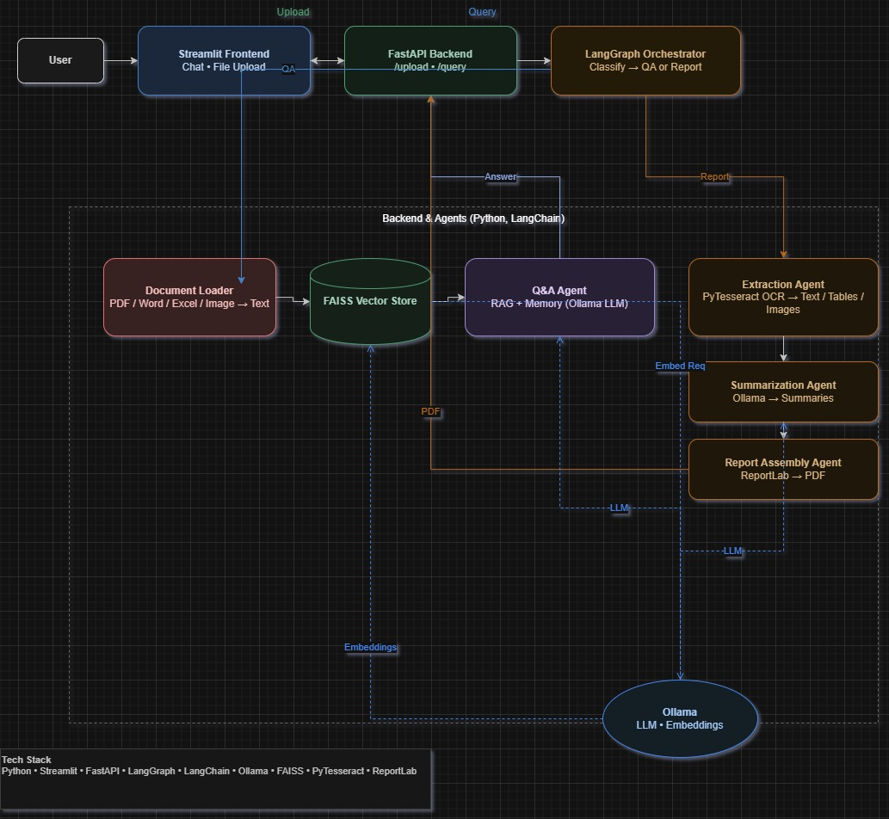

# Medical AI Assistant – GenAI Engineer Hiring Task

*All 4 compulsory parts are fully implemented.*  
*100% local, private, secure for medical data.*

---

## Hiring Task Requirements – 100% Covered

| *Part* | *Requirement* | *Implementation* |
|--------|------------------|---------------------|
| *Part 1* | RAG + memory across turns | FAISS + nomic-embed-text + ConversationBufferMemory |
| *Part 2* | Exact report + PDF export | ReportLab + *no rewriting* (only summarize if requested) |
| *Part 3* | Agentic flow + orchestrator | LangGraph + 6 specialized agents |
| *Part 4* | API + chat UI | FastAPI + Streamlit |

---

## Architecture Overview



> *User* → Streamlit → FastAPI → LangGraph Orchestrator →  
> → *QA Path*: FAISS → llama3:8b + memory  
> → *Report Path*: Extraction → ReportLab PDF

---

## Tech Stack (Why Chosen)

| Component | Tool | Reason |
|---------|------|--------|
| LLM | Ollama + llama3:8b | Local, private, free |
| Embeddings | nomic-embed-text | High-quality, lightweight |
| RAG | LangChain + FAISS | Fast, modular |
| Agents | LangGraph | Stateful workflows |
| Backend | FastAPI | Async, OpenAPI docs |
| Frontend | Streamlit | Rapid UI |
| PDF | ReportLab | Structured output |
| Parsing | PyPDF2, openpyxl, pytesseract | Multi-format support |

---

## How to Run (Any PC – Windows/Mac/Linux)


```powershell
# 1. Clone the project
git clone https://github.com/ppspoornesh/AI_medical_assistant.git
cd AI_medical_assistant

# 2. Create fresh virtual environment
python -m venv .venv
.\.venv\Scripts\activate    # Windows
# source .venv/bin/activate   # macOS/Linux

# 3. Install exact dependencies
pip install -r requirements.txt

# 4. Start Ollama (in a separate terminal)
ollama serve
ollama pull llama3:8b
ollama pull nomic-embed-text

# 5. Launch app
# Terminal 1 – Backend
uvicorn app.main:app --host 0.0.0.0 --port 8000

# Terminal 2 – Frontend
streamlit run frontend/streamlit_app.py --server.port 8501
